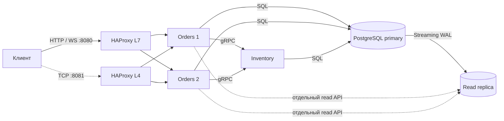

# Delivery Lab

[](https://github.com/Lev294/delivery-lab/actions/workflows/ci.yml)

**Создать заказ → зарезервировать товар → завершить заказ.** Демонстрационный стенд: два экземпляра
Orders, отдельный Inventory, HTTP/gRPC/WebSocket, HAProxy L7/L4 и PostgreSQL primary/read replica.
Локальный стенд на одном компьютере, без промышленной отказоустойчивости.

## Запуск

Нужны Git, Python 3, работающий Docker с Compose v2. Первый запуск требует интернета.

```bash
git clone https://github.com/Lev294/delivery-lab.git
cd delivery-lab
python3 scripts/init_env.py
docker compose up --build -d --wait
```

**Открой [панель управления](http://127.0.0.1:8080/lab)**: создать заказ, повторить запрос,
завершить, сравнить primary/replica и увидеть WebSocket. [Swagger API](http://127.0.0.1:8080/docs).

В существующей копии достаточно `git pull --ff-only`, `python3 scripts/init_env.py` и
`docker compose up --build -d --wait`. Скрипт добавит недостающий пароль репликации,
сохранив прежние пароли; SQL-миграция сохранит заказы и остаток.

Порты: **8080 — L7 HTTP**, **8081 — отдельный L4 TCP-опыт**. Меняются через `APP_PORT` и
`L4_PORT` в `.env`. Оба слушают только localhost. В `.env` генерируются локальные пароли,
файл исключён из Git и сборки. `.env.example` содержит только образцы.

## Где что находится

| Файл / папка | Назначение |
| --- | --- |
| `compose.yaml` | Процессы, сеть, зависимости запуска и тома |
| `delivery/api.py`, `delivery/lab.html` | HTTP, WebSocket и панель управления |
| `delivery/orders.py` | Путь заказа, две транзакции и вызов Inventory |
| `delivery/inventory.py` | gRPC-сервер, резерв и защита от повторов |
| `delivery/inventory_client.py` | gRPC-клиент и дедлайн |
| `proto/delivery/rpc/inventory.proto` | Контракт, написанный вручную |
| `delivery/rpc/*_pb2*.py` | Сгенерированный код; вручную не редактировать |
| `migrations/` | SQL-схема и её последовательные изменения |
| `infra/haproxy.cfg` | L7 и L4 конфигурации одного HAProxy |
| `infra/postgres/` | Физическая репликация, роли и bootstrap replica |
| `tests/`, `scripts/check_*.py` | Изолированные тесты и реальные сетевые/аварийные проверки |
| `.github/workflows/ci.yml` | Полный запуск, тесты и отказы в GitHub Actions |

## Архитектура



[Путь заказа и гарантии](docs/architecture.md) · [Решения и ограничения](docs/decisions.md)
· [Фактические проверки](docs/verification.md).

## Быстрая демонстрация и тесты

```bash
python3 scripts/demo.py
docker compose --env-file .env.example run --build --rm test
docker compose run --rm --no-deps test python -m scripts.check_stack
python3 scripts/check_faults.py
```

Последняя команда временно останавливает компоненты **этого Compose-проекта**, создаёт
несколько демонстрационных заказов и восстанавливает сервисы в `finally`. Один опыт:
`python3 scripts/check_faults.py --only replica` (также `app`, `inventory`, `timeout`,
`websocket`, `database`). При нестандартном HTTP-порте передай `--url http://127.0.0.1:ПОРТ`.
Тесты pytest используют отдельную `delivery_test`; сетевые демонстрации расходуют товар в основной БД.

```bash
docker compose ps
docker compose logs --tail=40 app app2 inventory proxy
docker compose exec postgres psql -U postgres -d delivery
docker compose down
```

В psql: `SELECT id, status, quantity FROM orders;`, `SELECT * FROM reservations;`,
`SELECT * FROM inventory;`. Выход: `\q`.
Обычный `down` сохраняет данные. **`docker compose down -v` удаляет все данные стенда**
и оба тома; после нового запуска товар снова имеет остаток 100. Применять только для намеренного сброса.

## Основной API

- `POST /orders`, JSON `{"sku":"demo-item","quantity":1}`, заголовок `Idempotency-Key: UUID`.
- `GET /orders/{id}` — согласованное чтение из primary.
- `PATCH /orders/{id}/status`, JSON `{"status":"completed"}`.
- `GET /inventory/demo-item` — HTTP → gRPC → Inventory.
- `GET /replica/orders/{id}`, `/replica/info` — явное чтение реплики.
- `WS /ws/orders/{id}` — снимок при подключении и изменениях, без истории пропущенных переходов.
- `/health/live`, `/health/ready` — процесс и его доступ к primary соответственно.

Создание: 201 для нового заказа, 200 для успешного повтора; 422 для неверного запроса,
409 при нехватке/конфликте ключа, 404 для неизвестного SKU/заказа. При сбое gRPC — 503/504:
**повторяй прежнее тело с прежним ключом**. При этом заказ может уже быть `pending`, а резерв — сохранён.
Отказ по наличию теперь сохраняется как `rejected`; после пополнения новое намерение требует нового ключа.
Завершать разрешено только `reserved`; повтор завершения не меняет остаток.

## Разработка и авторство

`uv sync --locked`; генерация gRPC: `uv run python scripts/generate_rpc.py`.
Версии пакетов закреплены в `uv.lock`, Docker-образов — digest. Применённые SQL-миграции
не редактировать: добавлять следующий файл.

Автор проекта — [Lev294](https://github.com/Lev294). Разработан с помощью ИИ.
Protobuf-обвязка генерируется из `.proto`. Начальная работа сохранена в Git,
старые `/hello` и `/delivery/estimate` доступны, [история архитектуры](docs/history/v02-architecture.md) сохранена.
