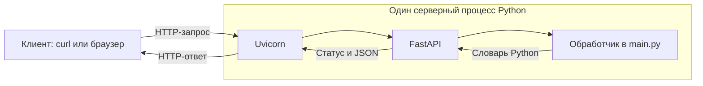

# Delivery Lab

Учебный backend на Python и FastAPI. Проект постепенно развивается в сервис доставки: создание заказов, резервирование остатков и обновления статусов.

Текущий этап — один HTTP-сервис с демонстрационным приветствием и расчётом времени доставки. Формула учебная: 10 минут подготовки плюс 3 минуты на каждый километр.

## Требования

| Инструмент | Версия |
| --- | --- |
| Python | 3.13.7 |
| uv | 0.12.14 |
| FastAPI | 0.141.1 |
| Uvicorn | 0.53.0 |

Python выбирается файлом `.python-version`, прямые зависимости описаны в `pyproject.toml`, полный набор зависимостей зафиксирован в `uv.lock`. Docker для текущего этапа не нужен.

Если uv ещё не установлен, используй [официальную инструкцию](https://docs.astral.sh/uv/getting-started/installation/). Для macOS/Linux:

```bash
curl -LsSf https://astral.sh/uv/0.12.14/install.sh | sh
```

Примени настройку PATH, указанную установщиком, или открой новый терминал. Проверь `uv --version`.

## Быстрый запуск

В терминале из корня проекта:

```bash
uv sync --locked
uv run uvicorn main:app --host 127.0.0.1 --port 8000
```

Первичная установка требует доступа к источнику пакетов. Если выбранный Python отсутствует, uv может скачать его автоматически.

- [Интерактивная документация API](http://127.0.0.1:8000/docs)
- [Схема OpenAPI](http://127.0.0.1:8000/openapi.json)

Остановка сервера: Ctrl+C в его терминале. После изменения исходника нужно сохранить файл и перезапустить сервер: автоматическая перезагрузка в этой команде выключена.

## API и проверки

Команды выполняются во втором терминале при работающем сервере:

```bash
curl -i http://127.0.0.1:8000/hello/Lev
curl -i http://127.0.0.1:8000/delivery/estimate/5
curl -i http://127.0.0.1:8000/delivery/estimate/0
curl -i http://127.0.0.1:8000/delivery/estimate/12
curl -i http://127.0.0.1:8000/delivery/estimate/abc
```

| Метод и путь | Ожидаемый ответ |
| --- | --- |
| `GET /hello/Lev` | 200, `{"message":"Hello, Lev!"}` |
| `GET /delivery/estimate/5` | 200, `{"distance_km":5,"estimated_minutes":25}` |
| `GET /delivery/estimate/0` | 200, `{"distance_km":0,"estimated_minutes":10}` |
| `GET /delivery/estimate/12` | 200, `{"distance_km":12,"estimated_minutes":46}` |
| `GET /delivery/estimate/abc` | 422, ошибка преобразования параметра пути в целое число |

Порядок ключей JSON не влияет на результат. Для успешных ответов проверяются код HTTP, имена полей и числовые значения.

## Архитектура



Uvicorn принимает соединения и передаёт запрос приложению через ASGI. FastAPI выбирает обработчик по методу и пути, преобразует входной параметр в `int` и формирует ответ. Функция `estimate` выполняет расчёт.

### Решение текущего этапа

**Проблема:** нужен небольшой работающий пример, на котором можно проследить весь путь запроса.

**Варианты:** один модуль приложения или несколько слоёв и сервисов с отдельными контрактами.

**Выбор:** один процесс, один модуль `main.py`, FastAPI и Uvicorn.

**Последствия:** запуск и путь запроса просты для изучения. По мере появления заказов и хранения данных потребуется выделить бизнес-логику и доступ к данным из HTTP-обработчиков.

## Демонстрация остановки процесса

1. При работающем сервере запросить существующий маршрут — ожидается HTTP 200.
2. Запросить неизвестный маршрут:

   ```bash
   curl -i --max-time 3 http://127.0.0.1:8000/missing
   ```

   Ожидается HTTP 404: приложение доступно, но такой маршрут не зарегистрирован.

3. Остановить сервер через Ctrl+C и повторить запрос:

   ```bash
   curl -i --max-time 3 http://127.0.0.1:8000/delivery/estimate/5
   ```

   Ожидается ошибка подключения без HTTP-ответа, если другой процесс не занял тот же адрес и порт.

4. Запустить сервер снова и повторить запрос — ожидается восстановление HTTP 200.

Терминал curl показывает ответ клиента. Терминал Uvicorn показывает серверные логи. Ошибка подключения не равна HTTP 404 или 500.

## Известные ограничения

- Расчёт времени условный; он не учитывает реальные условия доставки.
- Параметр проверяется на тип `int`, но отрицательное расстояние и верхний предел пока не ограничены.
- Заказы, база данных, резервирование остатков и уведомления ещё не реализованы.
- Проверки выполняются вручную через HTTP; pytest и CI появятся на следующем этапе.
- Один процесс на одном компьютере не обеспечивает автоматическое восстановление и не моделирует отказ отдельного узла или сетевое разделение.
- Проверены HTTP-ответы приложения на macOS с Apple M1. Проверка запуска из чистого Git-клона ещё не выполнена.
