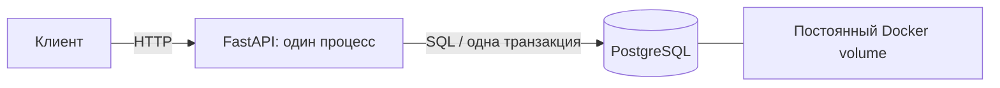

# Delivery Lab

[](https://github.com/Lev294/delivery-lab/actions/workflows/ci.yml)

Демонстрационный backend: **создать заказ → зарезервировать товар → завершить заказ**.
Версия 0.2: один FastAPI-сервис, PostgreSQL, атомарное резервирование, защита создания
от повторов, Docker Compose и интеграционные тесты. Это локальный демонстрационный стенд.

## Запуск из чистой копии

Нужны Git, Python 3 и Docker с Compose v2. Зависимости приложения находятся в образе.
Первый запуск скачивает образы и пакеты из интернета.

```bash
git clone https://github.com/Lev294/delivery-lab.git
cd delivery-lab
python3 scripts/init_env.py
docker compose up --build -d --wait
python3 scripts/demo.py
```

- [Swagger UI](http://127.0.0.1:8080/docs)
- [Готовность](http://127.0.0.1:8080/health/ready)
- [Остаток](http://127.0.0.1:8080/inventory/demo-item)

`init_env.py` создаёт `.env` со случайными локальными паролями, не перезаписывая
существующий файл. `.env.example` содержит образцы; настоящих секретов в Git нет.
Если 8080 занят, измени `APP_PORT` в `.env`; для demo передай `--url http://127.0.0.1:НОВЫЙ_ПОРТ`.

```bash
docker compose ps
docker compose logs --tail=50 app
docker compose down
```

Обычный `down` сохраняет том PostgreSQL. `docker compose down -v` **удаляет данные
стенда**; это явный сброс демонстрационной БД. Новый том начинает со 100 единиц `demo-item`.
Каждый запуск demo расходует одну единицу.

## Ручная демонстрация

```bash
curl -i http://127.0.0.1:8080/orders \
  -H 'Content-Type: application/json' \
  -H 'Idempotency-Key: 11111111-1111-4111-8111-111111111111' \
  -d '{"sku":"demo-item","quantity":2}'
```

Скопируй `id` ответа вместо `ORDER_ID`:

```bash
curl -i http://127.0.0.1:8080/orders/ORDER_ID
curl -i -X PATCH http://127.0.0.1:8080/orders/ORDER_ID/status \
  -H 'Content-Type: application/json' -d '{"status":"completed"}'
curl -i http://127.0.0.1:8080/inventory/demo-item
```

Для другого заказа нужен новый UUID-ключ. Повтор прежнего ключа с тем же телом возвращает
тот же заказ; с другим телом — конфликт. Уникальность проверяется БД.

| Запрос | Контракт |
| --- | --- |
| `POST /orders` | 201 при создании, 200 при повторе успешного намерения |
| `GET /orders/{id}` | 200 либо 404 |
| `PATCH /orders/{id}/status` | `{"status":"completed"}`, повтор безопасен |
| `GET /inventory/{sku}` | Доступный остаток |
| Неверное тело / нет корректного UUID-ключа | 422 |
| Не хватает товара / ключ использован с другим телом | 409 |
| БД недоступна или сработал её таймаут | 503; результат commit может быть неизвестен |
| `GET /health/live` | Доступность процесса |
| `GET /health/ready` | Дополнительно проверяет доступ к таблице БД |

Демонстрационные `GET /hello/{name}` и `/delivery/estimate/{distance_km}` сохранены.
Расстояние теперь ограничено диапазоном 0–50 включительно.

## Архитектура



- [Путь запроса и целевая схема](docs/architecture.md)
- [Решения, гарантии и ограничения](docs/decisions.md)
- [Фактические проверки](docs/verification.md)

## Тесты и CI

```bash
docker compose --env-file .env.example run --build --rm test
docker compose --env-file .env.example run --rm --no-deps test \
  sh -c 'ruff check --no-cache . && ruff format --check --no-cache .'
docker compose --profile test stop test-db
```

Тестовая БД `delivery_test` изолирована от демонстрационной `delivery`. Проверяются
HTTP-контракт через ASGI TestClient и настоящий PostgreSQL: откат транзакции,
одновременные повторы, конкуренция за остаток, ограничения БД и смена статуса.
`scripts/demo.py` отдельно проверяет настоящее HTTP-соединение.
GitHub Actions собирает образ, выполняет тесты и Ruff. Статус — по ссылке в badge.

Для редактирования в VS Code: `uv sync --locked`. Зависимости закреплены в `uv.lock`.
Docker использует Python 3.13.7, uv 0.12.14, PostgreSQL 17.11; образы закреплены digest.

## Объём и ограничения

Первый рабочий шаг реализован. Несколько экземпляров, L7/L4, Inventory с gRPC,
WebSocket и настоящая read replica добавляются следующими проверяемыми изменениями.
Они ещё не работают в этой версии.

Нет платежей, авторизации, TLS, автопереключения БД и резервных копий. HTTP слушает
только localhost. Это не промышленная отказоустойчивая система.

## Авторство и история

Автор проекта — [Lev294](https://github.com/Lev294). Разработан с помощью ИИ.

Начальная версия сохранена в истории Git.
