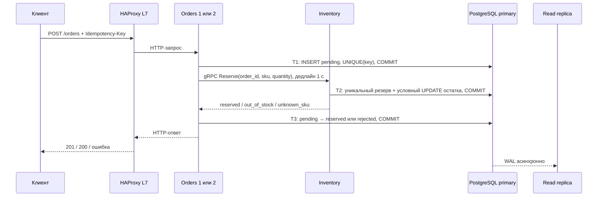

# Архитектура и путь данных, версия 1.0

Схема компонентов находится в README. Два экземпляра Orders — один и тот же код с разной
памятью процесса. Inventory — другой бизнес-сервис с gRPC-интерфейсом. Все используют
один PostgreSQL-кластер: Orders владеет `orders`, Inventory — `inventory` и `reservations`.
Владение логическое; роль БД пока общая, SQL-права между сервисами не разделены.

## Путь создания заказа

**Общей транзакции между сервисами нет.** T1/T2/T3 — независимые подтверждения.
Orders освобождает SQL-соединение до gRPC. Удерживать транзакцию во время сетевого ожидания
было бы дороже и всё равно не обеспечило бы атомарность двух сервисов.

При повторе ключа Orders находит тот же ID и проверяет совпадение SKU/количества.
Для `pending` повторяет Reserve с тем же order_id. Inventory сохраняет результат по
уникальному order_id вместе с изменением остатка. Повтор возвращает сохранённое решение.
Параллельные повторы не уменьшают товар снова. Финализация меняет только `pending`,
поэтому запоздалый повтор не превращает `completed` обратно в `reserved`.

Нехватка товара теперь сохраняет `rejected` и причину; остаток не меняется. Это намеренное
отличие от v0.2, где общий rollback удалял неуспешный заказ. Новый ключ — новое намерение.

## Таймаут и границы гарантии

Если Inventory подтвердил резерв, но ответ потерялся, Orders ещё не знает результата.
HTTP 504 здесь не означает отсутствия резерва. Повтор прежнего запроса завершает `pending`
по сохранённому решению Inventory. Если клиент не повторит запрос, `pending` может остаться
навсегда: фонового reconciler, отмены и освобождения резервов в стенде нет.
Это обеспечивает восстановление через повтор, но не обещание доставки ответа «ровно один раз».

## HTTP, gRPC и генератор

HTTP/JSON — внешний API и Swagger. `.proto` задаёт имена RPC и формат сообщений, но не SQL.
`scripts/generate_rpc.py` создаёт protobuf-классы и stub/servicer в `delivery/rpc/`.
`InventoryClient` вызывает generated stub; `Inventory` реализует generated servicer.
Сериализация, HTTP/2-транспорт и доставка вызова — gRPC runtime. Правила резерва — наш код.
CI проверяет, что генерация из зафиксированного `.proto` совпадает с сохранёнными файлами.
[Первичный источник: gRPC Python](https://grpc.io/docs/languages/python/basics/).

## L3, L4 и L7

L3 отвечает за IP-адресацию и передачу пакетов между сетями. Docker-сеть предоставляет
связность; сервисное DNS-имя разрешается в IP. Сам по себе IP-маршрут не понимает заказов.

L4-прокси на 8081 выбирает backend для TCP-соединения. Несколько HTTP-запросов внутри
этого соединения идут туда же. Новые соединения могут выбрать другой экземпляр.
L7-прокси на 8080 разбирает HTTP и выбирает backend для каждого запроса. Поэтому даже
один keep-alive TCP-канал клиента может давать ответы от обоих Orders.

Это два listener/backend в одном HAProxy. Отказ самого proxy — общая точка отказа.
L7 healthcheck проверяет HTTP-ready с доступом к primary, L4 — только установку TCP.
Удаление неисправного backend не мгновенно: inter=1s, fall=2. Запросы в момент отказа
могут завершиться ошибкой; активный WebSocket не мигрирует на другой процесс.
[Конфигурационный справочник HAProxy](https://www.haproxy.com/documentation/haproxy-configuration-manual/3-2r1/).

## Настоящая read replica

Replica создаётся `pg_basebackup -R -X stream` из primary и запускается с `standby.signal`.
WAL — журнал изменений PostgreSQL; walreceiver получает его, recovery применяет записи.
Подтверждение записи primary не ждёт реплики. `/orders/{id}` читает primary, а отдельный
`/replica/orders/{id}` позволяет наблюдать устаревший статус или временный 404 после создания.

`pg_is_in_recovery()` подтверждает роль standby; попытка UPDATE отвергается БД.
`pg_wal_replay_pause()` приостанавливает применение WAL, а не делает независимую копию
таблиц. После resume реплика догоняет primary. `last_replay_time` — время последней
воспроизведённой транзакции; на простаивающей БД это не достоверная величина задержки.
Проверять догоняние следует по конкретной записи либо позиции WAL.
[PostgreSQL standby](https://www.postgresql.org/docs/17/warm-standby.html),
[pg_basebackup](https://www.postgresql.org/docs/17/app-pgbasebackup.html).

## WebSocket

Браузер начинает handshake через L7; после upgrade остаётся двустороннее соединение с
выбранным Orders. Сервер отправляет текущий снимок заказа и новые снимки при изменениях.
Источником служит primary, а не локальная память и не потенциально отставшая реплика.

Каждый подписчик опрашивает БД примерно раз в секунду. Поэтому изменение, выполненное
через другой Orders, тоже видно. Это простое решение без брокера: цена — SQL-запрос
на каждый открытый сокет примерно каждую секунду. Промежуточные быстрые переходы могут
не попасть в снимки. При обрыве браузер переподключается и получает актуальный снимок;
гарантии доставки каждого события нет. Медленный клиент может ограничить частоту отправки
снимков; подписки и суммарное число сокетов промышленными лимитами не защищены.
