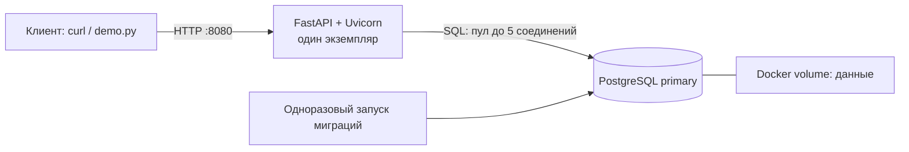
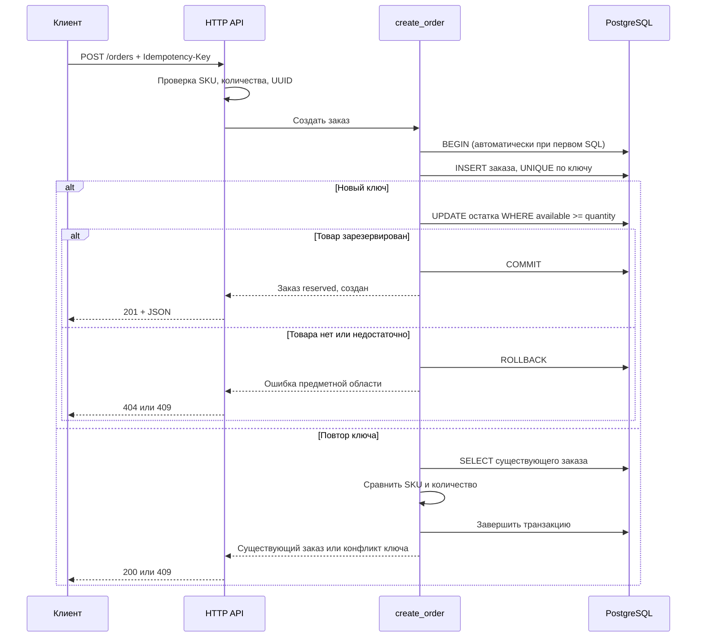
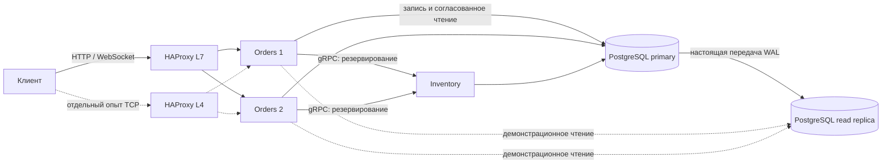

# Архитектура: текущая версия и следующий шаг

## Реализовано в версии 0.2

Docker Compose запускает приложение и PostgreSQL. Контейнер `migrate` завершается после
применения SQL; это не отдельный бизнес-сервис. Тесты используют другую БД в отдельном
контейнере, с временным хранилищем. Порт PostgreSQL на хост не публикуется.

Внутри приложения: `main.py` собирает приложение; `delivery/api.py` принимает HTTP и
преобразует ошибки; `delivery/orders.py` выполняет операции и SQL; `delivery/db.py`
управляет соединениями. Пока отдельного универсального repository-интерфейса нет:
один PostgreSQL и несколько коротких запросов не требуют дополнительной абстракции.

## Создание заказа

Ответ об успехе формируется после выхода из `with pool.connection()`, то есть после
подтверждения транзакции. `return` внутри `with` сначала вызывает выход из контекста.
Если ошибка произошла до успешного commit, обе записи откатываются. Обрыв сети во время
commit может оставить клиенту неизвестный исход: код 503 не доказывает отсутствия записи.
Безопасный повтор использует прежний ключ и прежнее тело.

## К чему идём — пока не реализовано

Это целевая схема, а не описание уже работающих возможностей. Два сервиса будут
владеть своими таблицами; для экономии ресурсов допускается один кластер primary/replica.
При выделении Inventory общая SQL-транзакция перестанет охватывать резервирование и заказ.
Этот переход требует отдельного решения для повторов и неизвестного результата gRPC.

L3 изучаем как доставку IP-пакетов между сетями; отдельный маршрутизатор в стенд не добавляем.
L4 проверим отдельной конфигурацией TCP-прокси, L7 — основной HTTP-балансировкой.
Подробные гарантии каждого механизма появятся вместе с проверенной реализацией.
